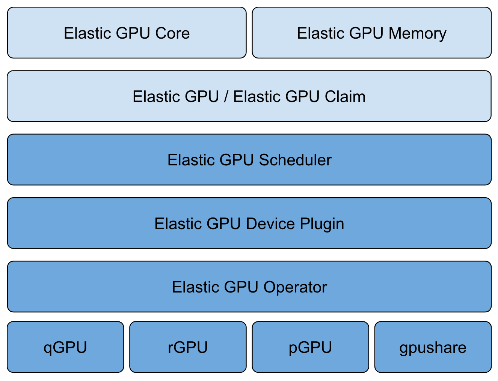

# Elastic GPU Scheduler
<!-- ABOUT THE PROJECT -->

## About This Project
With the continuous evolution of cloud native AI scenarios, more and more users run AI tasks on Kubernetes, which also brings more and more challenges to GPU resource scheduling. 

*Elastic gpu scheduler* is a gpu scheduling framework based on Kubernetes, which focuses on gpu sharing and allocation.

You may also be interested in *Elastic GPU Agent* which is a Kubernetes device plugin implement.

## Motivation
In the GPU container field, GPU providers such as nvidia have introduced a docker-based gpu containerization project that allows users to use GPU cards in Kubernetes Pods via the Kubernetes extended resource with the nvidia k8s device plugin. However, this project focuses more on how containers use GPU cards on Kubernetes nodes, and not on GPU resource scheduling.

Elastic GPU scheduler is based on Kubernetes extended scheduler, which can schedule gpu cores, memories, percents, share gpu with multiple containers and even spread containers of pod to different GPUs. The scheduling algorithm supports binpack, spread, random and other policies. In addition, through the supporting elastic gpu agent, it can be adapted to nvidia docker, gpushare, qgpu and other gpu container solutions. Elastic GPU scheduler mainly satisfies the GPU resources scheduling and allocation requirements in Kubernetes.

## Architecture


## Prerequisites
- Kubernetes v1.17+
- golang 1.16+
- [NVIDIA drivers](https://github.com/NVIDIA/nvidia-docker/wiki/Frequently-Asked-Questions#how-do-i-install-the-nvidia-driver) 
- [nvidia-docker](https://github.com/NVIDIA/nvidia-docker) 
- set `nvidia` as docker `default-runtime`:  add `"default-runtime": "nvidia"` to `/etc/docker/daemon.json`, and restart docker daemon.  
## Build Image

Run `make` or `TAG=<image-tag> make` to build elastic-gpu-scheduler image

## Getting Started
1.  Deploy Elastic GPU Agent
```
$ kubectl apply -f https://raw.githubusercontent.com/elastic-gpu/elastic-gpu-agent/master/deploy/elastic-gpu-agent.yaml
```
For more information , please refer to [Elastic GPU Agent](https://github.com/elastic-gpu/elastic-gpu-agent).

2. Deploy Elastic GPU Scheduler
```
$ kubectl apply -f deploy/elastic-gpu-scheduler.yaml
```

3. Enable Kubernetes scheduler extender
Add the following configuration to `extenders` section in the `--policy-config-file` file (`<elastic-gpu-scheduler-svc-clusterip>` is the cluster IP of `elastic-gpu-scheduler service`, which can be found by `kubectl get svc elastic-gpu-scheduler -n kube-system -o jsonpath='{.spec.clusterIP}' `):
```
{
  "urlPrefix": "http://<elastic-gpu-scheduler-svc-clusterip>:39999/scheduler",
  "filterVerb": "filter",
  "prioritizeVerb": "priorities",
  "bindVerb": "bind",
  "weight": 1,
  "enableHttps": false,
  "nodeCacheCapable": true,
  "managedResources": [
    {
      "name": "elasticgpu.io/gpu-memory"
    },
    {
      "name": "elasticgpu.io/gpu-core"
    }
  ]
}
```

You can set a scheduling policy by running `kube-scheduler --policy-config-file <filename>` or `kube-scheduler --policy-configmap <ConfigMap>`. Here is a [scheduler policy config sample](https://github.com/kubernetes/examples/blob/master/staging/scheduler-policy/scheduler-policy-config.json).

4. Create pod sharing one GPU
```
cat <<EOF  | kubectl create -f -
apiVersion: apps/v1
kind: Deployment
metadata:
  name: cuda-gpu-test
  labels:
    app: gpu-test
spec:
  replicas: 1
  selector:
    matchLabels:
      app: gpu-test
  template:
    metadata:
      labels:
        app: gpu-test
    spec:
      containers:
        - name: cuda
          image: nvidia/cuda:10.0-base
          command: [ "sleep", "100000" ]
          resources:
            limits:
              elasticgpu.io/gpu-memory: "256" // 256MB memory 
EOF
```

5. Create pod with multiple GPU cards

```
cat <<EOF  | kubectl create -f -
apiVersion: apps/v1
kind: Deployment
metadata:
  name: cuda-gpu-test
  labels:
    app: gpu-test
spec:
  replicas: 1
  selector:
    matchLabels:
      app: gpu-test
  template:
    metadata:
      labels:
        app: gpu-test
    spec:
      containers:
        - name: cuda
          image: nvidia/cuda:10.0-base
          command: [ "sleep", "100000" ]
          resources:
            limits:
              elasticgpu.io/gpu-core: "200" // 2 GPU cards
EOF
```

<!-- ROADMAP -->

## Roadmap
- Support GPU topology-aware scheduling
- Support GPU load-aware scheduling

<!-- LICENSE -->

## License
Distributed under the [Apache License](./LICENSE).

